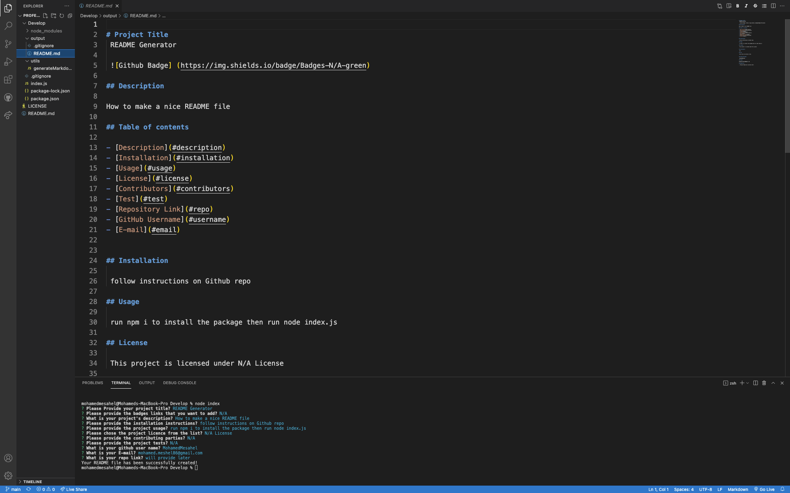

# Professional-README-Generator

## Description
This open source project that allows user to generate qucik README file. 
This app includes, how to use the app, how to install it, and how to make contributions.
Using this app you can quickly and easily create a README file by using a command-line application to generate one. This allows the project creator to devote more time to working on the project.

## Installation:
- Download it through Github
- Run npm i or (npm install), to make sure to download the jason package and inquirer.

## Usage
After installation run command `node index.js` in the command line then the app will start to ask you series of questions to build your README.md file, after answering all the questions your README.file will be generated in the output folder.

## User Story
AS A developer
I WANT a README generator
SO THAT I can quickly create a professional README for a new project.

## Challenges
My challanges for this project was trying to put all the pieces together from JavaScript and NodeJS, however at the end I was abl to make sure that everything runnig smoothly.

### Screen Shots

## Demo 
[README-Generator](https://www.awesomescreenshot.com/video/4523548?key=df7885971a5aefa8ba46195c1918ba18)

### Licensing

